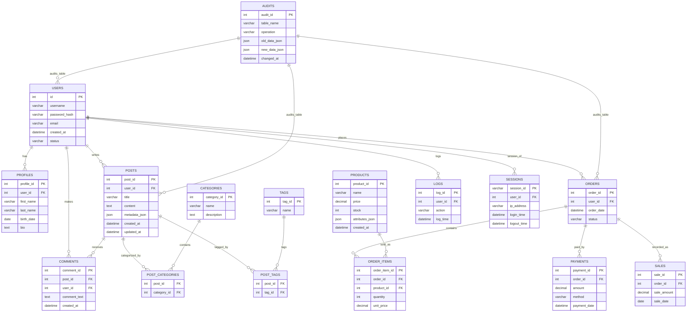

# MySQL ER Diagram

```mermaid
erDiagram
    USERS {
        int id PK
        varchar username
        varchar password_hash
        varchar email
        datetime created_at
        varchar status
    }
    PROFILES {
        int profile_id PK
        int user_id FK
        varchar first_name
        varchar last_name
        date birth_date
        text bio
    }
    POSTS {
        int post_id PK
        int user_id FK
        varchar title
        text content
        json metadata_json
        datetime created_at
        datetime updated_at
    }
    COMMENTS {
        int comment_id PK
        int post_id FK
        int user_id FK
        text comment_text
        datetime created_at
    }
    CATEGORIES {
        int category_id PK
        varchar name
        text description
    }
    POST_CATEGORIES {
        int post_id FK
        int category_id FK
    }
    TAGS {
        int tag_id PK
        varchar name
    }
    POST_TAGS {
        int post_id FK
        int tag_id FK
    }
    PRODUCTS {
        int product_id PK
        varchar name
        decimal price
        int stock
        json attributes_json
        datetime created_at
    }
    ORDERS {
        int order_id PK
        int user_id FK
        datetime order_date
        varchar status
    }
    ORDER_ITEMS {
        int order_item_id PK
        int order_id FK
        int product_id FK
        int quantity
        decimal unit_price
    }
    PAYMENTS {
        int payment_id PK
        int order_id FK
        decimal amount
        varchar method
        datetime payment_date
    }
    SALES {
        int sale_id PK
        int order_id FK
        decimal sale_amount
        date sale_date
    }
    LOGS {
        int log_id PK
        int user_id FK
        varchar action
        datetime log_time
    }
    SESSIONS {
        varchar session_id PK
        int user_id FK
        varchar ip_address
        datetime login_time
        datetime logout_time
    }
    AUDITS {
        int audit_id PK
        varchar table_name
        varchar operation
        json old_data_json
        json new_data_json
        datetime changed_at
    }

    USERS ||--o{ PROFILES : has
    USERS ||--o{ POSTS : writes
    USERS ||--o{ COMMENTS : makes
    POSTS ||--o{ COMMENTS : receives
    POSTS ||--o{ POST_CATEGORIES : categorized_by
    CATEGORIES ||--o{ POST_CATEGORIES : contains
    POSTS ||--o{ POST_TAGS : tagged_by
    TAGS ||--o{ POST_TAGS : tags
    USERS ||--o{ ORDERS : places
    ORDERS ||--o{ ORDER_ITEMS : contains
    PRODUCTS ||--o{ ORDER_ITEMS : sold_as
    ORDERS ||--o{ PAYMENTS : paid_by
    ORDERS ||--o{ SALES : recorded_as
    USERS ||--o{ LOGS : logs
    USERS ||--o{ SESSIONS : session_of
    AUDITS ||--o{ USERS : audits_table
    AUDITS ||--o{ POSTS : audits_table
    AUDITS ||--o{ ORDERS : audits_table
```

